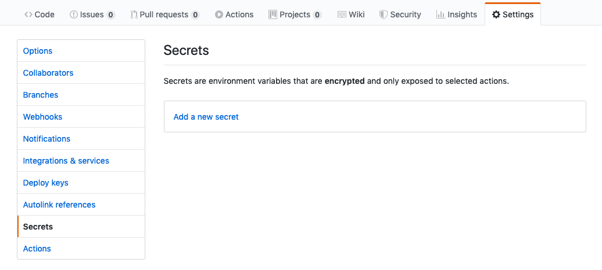
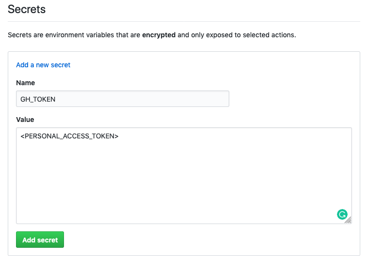

# angular-cli-ghpages: README for setting up deployment with GitHub Actions

As Github has introduced [Github Actions](https://github.com/features/actions), I would prefer to run all my CI tasks in it only, rather than going to some other CI providers. This guide is aimed to help out developers, who want to deploy their Angular app in Github Page using [angular-cli-pages](https://github.com/angular-schule/angular-cli-ghpages).

## Prerequisites

1. You've signed up for the GitHub Actions beta and taken a look at the documentation for the new [GitHub Actions](https://github.com/features/actions) format and/or understand the purpose of GitHub Actions.
2. You've written some form of YML code before and/or have minimal knowledge of the syntax
3. You already have a working Angular app that can be deployed to GitHub Pages
4. You have already added **angular-cli-ghpages** in your project. If not:
   - Please checkout [Quick Start Guide](https://github.com/angular-schule/angular-cli-ghpages#-quick-start-local-development-) 
   - Or simply run `ng add angular-cli-ghpages` in your project.

## Getting started

Please ensure that you've read the prerequisites section before continuing with this section.

### Setup Tokens

1. Create a [Personal Access Token with repo access](https://help.github.com/en/articles/creating-a-personal-access-token-for-the-command-line) (POA) and copy the token.
   - Make sure it has this access:
  
        
2. Open up your Github repo.
3. Go to **Settings** > **Secrets** and click on **Add a new secret** link.

    
4. Create a secret with name `GH_TOKEN` and paste your POA, which you copied in step 1, in value.

    

### Setup Github Action Flow

1. Open up your Github repo.
2. Go to **Actions** amd click on **Set up workflow yourself**.

    

3. A New File editor will open, keep the file name (e.g. *main.yml*) as it is, simply replace all content to below:

    ```yml
    name: Node CI

    on: [push]

    jobs:
    build:
        runs-on: ubuntu-latest

        steps:
        - uses: actions/checkout@v1
        - name: Use Node.js 10.x
            uses: actions/setup-node@v1
            with:
            node-version: 10.x
        - name: npm install, lint, test, build and deploy
            run: |
            npm install
            npm run lint
            ###
            # You can comment below 2 test scripts, if you haven't [configured CLI for CI testing in Chrome](https://angular.io/guide/testing#configure-cli-for-ci-testing-in-chrome)
            ###
            npm test -- --no-watch --no-progress --browsers=ChromeHeadlessCI
            npm run e2e -- --protractor-config=e2e/protractor-ci.conf.js
            npm run deploy -- --name="<YOUR_GITHUB_USERNAME>" --email=<YOUR_GITHUB_USER_EMAIL_ADDRESS>
            env:
            CI: true
            GH_TOKEN: ${{ secrets.GH_TOKEN }}
    ```

4. Make sure to replace **<YOUR_GITHUB_USERNAME>** and **<YOUR_GITHUB_USER_EMAIL_ADDRESS>** with correct values in above snippet.
5. You can also control when your workflows are triggered:
   - It can be helpful to not have your workflows run on every push to every branch in the repo.
     - For example, you can have your workflow run on push events to master and release branches:

        ```yml
        on:
        push:
            branches:
            - master
            - release/*
        ```

     - or only run on pull_request events that target the master branch:

        ```yml
        on:
          pull_request:
            branches:
            - master
        ```

     - or, run every day of the week from Monday - Friday at 02:00:

        ```yml
        on:
          schedule:
          - cron: 0 2 * * 1-5
        ```

   - For more information see [Events that trigger workflows](https://help.github.com/articles/events-that-trigger-workflows) and [Workflow syntax for GitHub Actions](https://help.github.com/articles/workflow-syntax-for-github-actions#on).

6. Commit and Push to add the workflow file.
7. Done.

## Notes

    Please note that GitHub Actions is currently in beta and is not currently suited/intended to be for use in production.
    Please note that the steps above may be modified at any time for reasons including the discovering of new ways to simplify the steps/process of deployment or for other reasons not explicitly mentioned.
